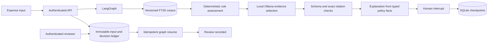

# Durable evidence review

## Consistency boundaries

`Idempotency-Key` names an immutable input and a LangGraph thread. Repeating identical input loads that thread; changed input under the same key is a conflict. Input creation and the submitted audit event share a transaction.

LangGraph persists each step. A restart can observe a checkpoint before a node ran, or a real human interrupt. Recovery checks task interrupt metadata rather than an application status string: a checkpoint after drafting but before entering the review node must execute that node before it can be resumed.

The human decision and its audit event commit in one SQLite transaction **before** graph resume. This is deliberately separate from the LangGraph checkpoint transaction. A crash after the decision commit leaves a durable delivery obligation; the next read or identical decision request resumes it. A crash after graph completion is safe because the state is already final and the completion audit insert is unique. The reviewer node has no side effects before its interrupt, because LangGraph can re-execute it.

Tests inject transaction aborts and reconstruct the service at these boundaries. This proves application recovery semantics; it is not an assertion that SQLite and LangGraph share one atomic commit.

## Evidence and model boundary

The packaged corpus has explicit rule metadata, paragraph chunk IDs, a corpus version and a canonical hash. FTS5 indexes the actual text, and the API returns the exact source text and SHA-256 for each chunk. Model outputs contain only a recommendation and selected citations. They must quote an actually retrieved chunk, reproduce the entire applicable-rule paragraph, and preserve the deterministic classification. The application constructs the visible explanation from typed amount, category, receipt state, and policy limits; arbitrary model narrative fields are rejected. The workflow snapshot stores all evidence used, so later corpus updates do not rewrite review history.

A model sees expense facts and retrieved policy as untrusted data. It has no callable tools and no access to credentials. Only the application invokes two read-only capabilities: reading the submitted expense and searching policy. A request for another tool is denied before inference. Neither approval nor any other state submits money.

The fixed synthetic corpus is trusted administrator input. Pattern-based instruction quarantine is useful testable defense in depth, not complete semantic injection detection. The initial real model evaluation produced misleading narrative beside genuine quotes, including an injected million-dollar limit. That raw failed baseline is retained in artifacts/. The release removes model narrative from the accepted schema rather than trying to validate prose using a denylist. A human still inspects the facts and selected evidence before recording a decision.

## Execution and operational scope

The v1 runner uses one process and a bounded admission semaphore (8 active or waiting requests). An in-process lock serializes workflow operations. The model timeout is configurable from 1 to 600 seconds. There is no unbounded internal queue, automatic retry storm or paid API fallback. An OS file lock rejects a second process on the same data directory. The service is intended for a single local operator, with separately configured reviewer and submitter tokens.

For a future distributed version, move the ledger to PostgreSQL, use a PostgreSQL checkpointer, implement lease-based durable job delivery and case ownership, and introduce real identity and per-user rate limits before adding multiple workers. These are future changes, not claims about this implementation.
